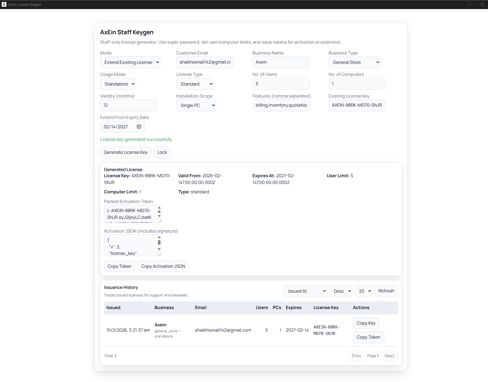

# AxEin License Keygen (Staff Handbook)

This handbook is for AxEin staff only. The Keygen application issues offline activation tokens for AxEin Billing Desktop.

Do not share Keygen installers or private keys with customers.

## What Keygen Does

- Generates an **Activation Token** (single line starting with `L-...`)
- Generates an **Activation JSON** (JSON payload + `signature`)
- Maintains an issuance history (who/when/seats/computers/expiry)

Customers activate the Billing app by pasting either the token or JSON into the License screen.

## Installation (Windows)

1. Install `AxEin License Keygen_..._x64-setup.exe`.
2. Launch **AxEin License Keygen**.

Default EXE path:

- `%LOCALAPPDATA%\\Programs\\AxEin License Keygen\\AxEin License Keygen.exe`

## Security Model

Keygen requires:

1. **Admin context** (Keygen sets this automatically in the UI)
2. **Unlock** using a strong **Super Password**

Super Password is validated server-side and is not meant to be public.

Operational guidance:

- Store the Super Password in your password manager.
- Rotate it when staff changes.
- Never include it in customer-facing documentation.

## First Use: Unlock Keygen

1. Open the Keygen app.
2. Enter the Super Password.
3. Click `Unlock`.

If unlock succeeds, Keygen remains unlocked for a limited time.

## Issue A License (New)

Use `New` mode when onboarding a customer for the first time.

Fill in:

- Customer email
- Business name
- Business type
- Usage mode:
  - `standalone` for a single PC
  - `lan_host` for multi-computer LAN usage
- Seats (`user_limit`)
- Computers (`computer_limit`)
- Validity period (months)
- Features (enable modules needed)

Then click `Generate`.

Outputs:

- **Activation Token**: copy and share with customer
- **Activation JSON**: alternative activation method

## Extend A License (Renewal)

Use `Extend` mode when renewing an existing customer license:

- Enter `existing_license_key`
- Select/enter the extension start date (typically current expiry)
- Choose renewal months

Click `Generate`.

Keygen will produce a new activation token for the extension.

## Issuance History

History helps you track:

- Which business received which limits and expiry dates
- Who issued it and when

Use:

- Sort by `created_at`, `expires_at`, `business_name`, `user_limit`
- Pagination controls for large histories

If history shows `Admin context required`, you are likely calling the API manually without headers (see Troubleshooting).

## What To Send To Customers

Preferred:

- Activation Token (`L-...`)

Alternative:

- Activation JSON (must include `signature`)

Never send:

- Private keys
- Keygen installer
- Super Password

## Checklist Before Issuing A Token

- Confirm customer email and business name spelling
- Confirm intended seats and computers
- Confirm if they need LAN mode
- Confirm expiry date is correct

